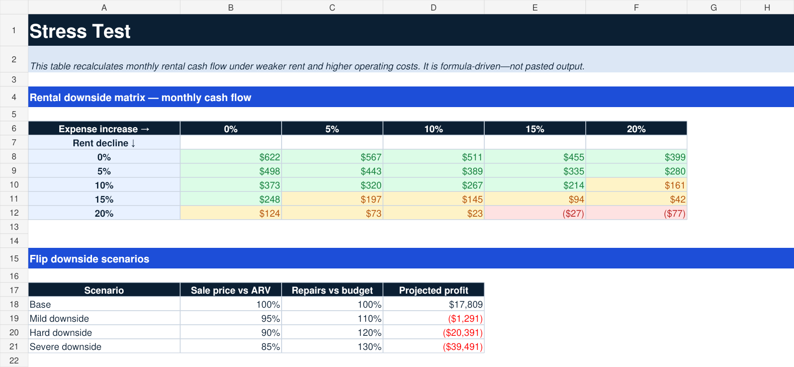
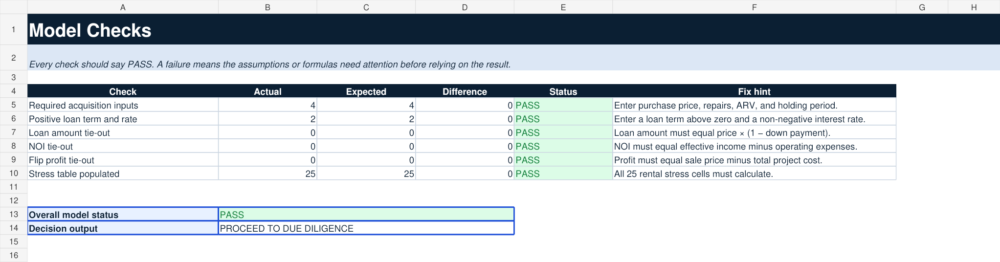

# DealCheck Pro

A working residential real-estate screening model for Excel.

DealCheck Pro lets an investor enter a property once, compare rental and flip outcomes, stress-test weak assumptions, calculate a safety-oriented offer ceiling, and see exactly why the model says **proceed**, **negotiate**, or **pass**.

> Analysis aid only. This workbook is not an appraisal, inspection, title report, legal opinion, tax opinion, lending commitment, or guarantee of profit.

## Download the working model

**[Download DealCheck Pro v1](workbook/DealCheck-Pro-v1.xlsx)**

The workbook opens with a fully calculated sample deal so every formula, decision rule, and check can be inspected before entering a real property.

## See the working model

### Decision dashboard

### Formula-driven downside testing

### Visible integrity checks

## Five-minute workflow

1. Open **Property Input**.
2. Replace only the yellow cells.
3. Open **Analysis** for the rental-versus-flip decision.
4. Open **Stress Test** to see when the deal breaks.
5. Confirm that **Checks** reports PASS.

## What v1 actually implements

### Rental analysis

- gross scheduled income
- vacancy-adjusted effective income
- operating expenses
- net operating income
- cap rate
- monthly and annual cash flow
- cash invested
- cash-on-cash return
- debt-service coverage ratio
- basis-to-ARV ratio
- configurable rental score and decision

### Flip analysis

- sale proceeds
- selling costs
- financing carry
- tax, insurance, and HOA carry
- total project cost
- projected profit
- return on cash invested
- profit margin
- maximum allowable offer
- offer headroom
- basis-to-ARV ratio
- break-even sale price
- configurable flip score and decision

### Risk controls

- 25-cell rental downside matrix
- rent declines from 0% through 20%
- operating-expense increases from 0% through 20%
- four flip downside scenarios
- repair overruns through 30%
- resale reductions through 15%
- conservative offer buffer
- configurable minimum-return rules
- visible formula tie-outs and model status

## Verified sample result

The included sample property produces:

| Output | Result |
|---|---:|
| Rental score | 98 / PASS |
| Monthly rental cash flow | $622 |
| Cash-on-cash return | 8.1% |
| DSCR | 1.44x |
| Flip score | 63 / REVIEW |
| Projected flip profit | $17,809 |
| Safe offer ceiling | $215,000 |
| Current price versus ceiling | ($35,000) |
| Overall decision | Proceed to due diligence |

These results are generated by workbook formulas from the sample assumptions. They are not hardcoded dashboard values.

## Workbook structure

| Sheet | Purpose |
|---|---|
| **Start Here** | Plain-language instructions, color legend, limitations, and version information |
| **Property Input** | Acquisition, financing, operations, and decision-rule assumptions |
| **Analysis** | Rental and flip economics, scores, strategy recommendation, and offer ceiling |
| **Stress Test** | Formula-driven rental matrix and flip downside scenarios |
| **Checks** | Input completeness, loan, NOI, profit, and stress-table integrity tests |

## Financial-model conventions

- Yellow cells with blue text are editable assumptions.
- Black text represents calculations.
- Green text represents linked outputs or passing decisions.
- Inputs, calculations, stress cases, and checks are separated.
- Important outputs are formula-driven.
- Calculation areas do not embed hidden business thresholds; decision rules live in visible input cells.
- Formula errors are scanned before release.
- Every worksheet is rendered and visually inspected before release.

## Validation completed for v1

- no REF, DIV/0, VALUE, NAME, N/A, or NUM formula errors
- loan amount ties to price and down payment
- NOI ties to effective income less operating expenses
- flip profit ties to sale price less total project cost
- all 25 rental stress cells calculate
- all six model checks report PASS
- all five sheets pass visual inspection

## Honest limitations

Version 1 is a fast residential screening model. It does not yet include:

- detailed renovation draw schedules
- tax depreciation
- refinance closing costs and seasoning rules
- BRRRR refinance proceeds and post-refinance returns
- multi-year rent and expense growth
- amortization schedule detail
- partnership waterfalls
- short-term-rental seasonality
- live property, rent, tax, insurance, or lender data
- legal, title, inspection, permitting, HOA, or environmental review

Those belong in later versions and should not be implied by the current workbook.

## Development approach

The project uses incremental delivery with shippable workbook releases, visible acceptance criteria, formula-level checks, and visual QA.

**Current status: v1 working release.**
